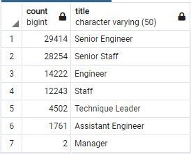
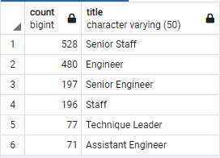

# Pewlett-Hackard-Analysis
## Overview
The purpose of this project was to determine the number of retiring employees per title and identify employees who are eligible to participate in a mentorship program.
##Results
-	90,398 employees are retirement age
-	29,414 of the retirement age employees are Senior Engineers
-	28,254 of the retirement age employees are Senior Staff
-	1,549 employees are mentorship eligible
-	528 of the mentorship eligible employees are senior staff
-	480 of the mentorship eligible employees are Engineers
## Summary
90,398 roles will need to be filled from the “silver tsunami.” 
There are only 1,549 mentorship eligible employees and 90,398 employees nearing retirement age so I don’t think there are going to be enough mentors to train the incoming employees once the older ones start retiring.

